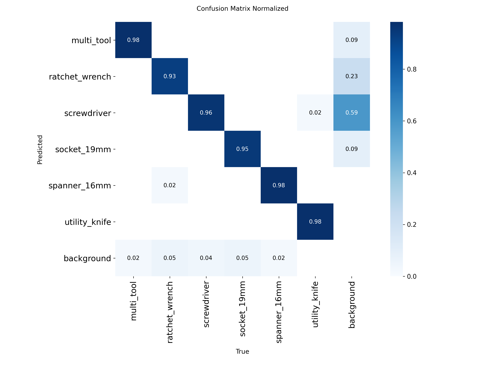
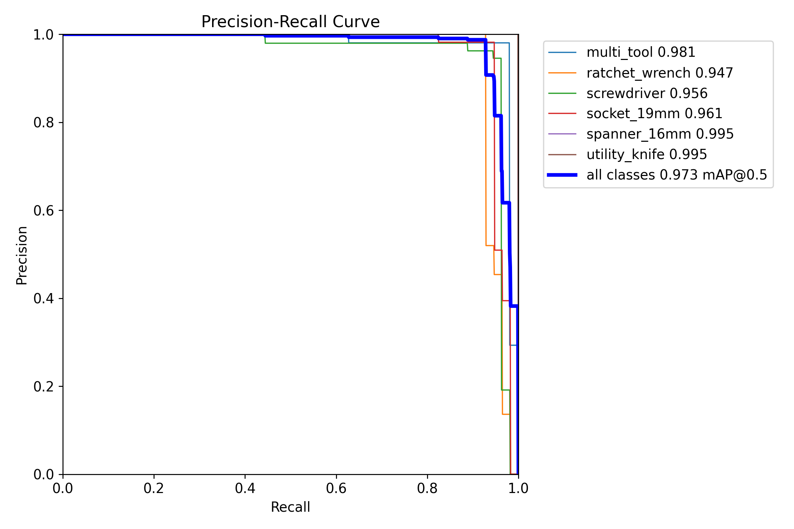

# Voice-Commanded Tool Delivery Robot Arm

> 음성 명령으로 공구함에서 공구를 꺼내 전달하고 반납 시 제자리에 돌려놓는 협동 로봇팔 시스템.
> **현재 단계:** Phase 2 진행 중 — 5종 공구 클래스 확정, YOLOv11s 전환, 이미지 수집 준비 완료.

---

## 한 줄 요약

Doosan e0509 협동 로봇팔이 운영자의 음성 명령을 듣고 공구함의 9종 공구를 Staging Area에 거치/회수하는 시스템. 세 가지 제어 방식(BT+DSR, BT+RL, end-to-end VLA)을 동일 하드웨어에서 비교 평가한다.

## 누구를 위한 저장소인가

- **연구**: 구조화된 BT+unit_actions vs end-to-end 학습 기반 제어 비교
- **운영**: 실험실/소규모 정비소에서 공구 관리 자동화
- **교육**: 협동 로봇 + 비전 + LLM + 안전 시스템 통합 사례

---

## Quick Start

### 처음 클론한 팀원

| 순서 | 작업 | 상세 |
|------|------|------|
| 1 | AI 도구 설정 | [`docs/ai-setup.md`](docs/ai-setup.md) — Claude Code/Codex/Cursor 비교 + 설정 |
| 2 | 프로젝트 개요 파악 | [`CLAUDE.md`](CLAUDE.md) (Claude Code) 또는 [`AGENTS.md`](AGENTS.md) (Codex/Gemini) — 아키텍처 한눈에 보기 |
| 3 | Phase 일정 확인 | [`robot-arm-project.md`](robot-arm-project.md) — Phase 0–9 로드맵 |
| 4 | 환경 변수 설정 | `cp .env.example .env` → 값 채우기 (팀장에게 문의) |
| 5 | 룰 숙지 | [`.claude/rules/`](.claude/rules/) — safety/engineering/process |

### 실행 (코드 구현 후)

```bash
./run.sh --track A          # Gemma 4 + BT + DSR
./run.sh --track B          # Gemma 4 + BT + RL
./run.sh --track C          # 키워드 파서 + VLA (no ROS2)
./run.sh --track A --sim    # 시뮬레이션
./run.sh --help             # 전체 옵션
```

---

## 시스템 구성

### 하드웨어

| 구성요소 | 모델 |
|----------|------|
| 로봇팔 | Doosan e0509 (6-DOF 협동) |
| 그리퍼 | ROBOTIS RH-P12-RN |
| 카메라 (탑뷰) | Intel RealSense D455f (eye-to-hand, 탑뷰 고정 · YOLOv11s 추론 · scene context) |
| 카메라 (그리퍼) | Logitech C270 HD Webcam (그리퍼 마운트 · YOLOv11s 추론) |
| PLC | LS Electric XBC-DR14E |
| 메인 PC | Vector 16 HX AI A2XWIG |
| 보조 PC | HP ProBook 450 G10 (모니터링) |

상세 → [`docs/hardware.md`](docs/hardware.md)

### 소프트웨어 스택

| 레이어 | Track A/B | Track C |
|--------|-----------|---------|
| OS | Ubuntu 22.04 | 동일 |
| 미들웨어 | ROS2 Humble | (없음 — 단일 Python) |
| STT | Whisper small | 동일 |
| 의도 분류 | Gemma 4 (로컬) | Python 키워드 파서 |
| 모션 | DSR 좌표 제어 (A) / RL 정책 (B) | VLA 모델 end-to-end |
| 비전 | YOLOv11s + 6D pose | VLA 입력 (raw RGB-D) |
| 하드웨어 인터페이스 | `doosan-robot2` ROS2 드라이버 | Doosan Python SDK 직접 |

---

## 저장소 구조

```
.
├── README.md                  ← 이 파일
├── CLAUDE.md                  ← Claude Code 사용자용 프로젝트 개요
├── AGENTS.md                  ← Codex/Gemini CLI 사용자용 미러 (동일 룰 요약)
├── robot-arm-project.md       ← Phase 0–9 개발 계획
├── run.sh                     ← Track Selector
├── architecture.html          ← 인터랙티브 시각화
├── docs/                      ← 모든 설계 문서
│   ├── architecture.md            아키텍처 + 패키지 구조
│   ├── adr/                       ADR (카테고리별) + 미결 사항 — index.md로 시작
│   ├── conventions.md             네이밍 + 수락 기준
│   ├── interfaces.md              msg/srv/action 계약
│   ├── frames.md                  좌표계 + TF tree
│   ├── hardware.md                하드웨어 인벤토리
│   ├── simulation.md              Gazebo 골든 파일 회귀 + Isaac Sim (Track B RL)
│   ├── db-schema.md               DB 논리 스키마
│   ├── ai-setup.md                AI 도구 설정 안내
│   ├── logging.md                 로깅 인프라 (파일 위치, 순환, DB 이벤트)
│   ├── demo-collection-workflow.md  Track C demonstration 수집 워크플로우
│   └── glossary.md                용어 사전
├── config/                    ← 비-시크릿 운영 파라미터
│   ├── runtime.yaml               robot_model, whisper_size 등
│   ├── staging_area.yaml          공구별 거치 좌표
│   ├── toolbox.yaml               슬롯 + 공구 카탈로그
│   ├── hand_eye.yaml              D455f 탑뷰 카메라-EE 변환
│   ├── c270_hand_eye.yaml         C270 그리퍼 카메라-EE 변환 (eye-in-hand)
│   ├── c270_camera_info.yaml      C270 인트린직 캘리브레이션 결과
│   ├── robot_poses.yaml           home/scan 포즈
│   └── fod.yaml                   FOD 임계
├── interfaces/                ← ROS2 msg/srv/action (코드 구현 시)
│   └── CHANGELOG.md
├── scripts/multi_item/        ← 캘리브레이션·인식에 사용하는 물리 아이템 (마커·체커보드) 관리
│   ├── README.md                  아이템 목록 인덱스
│   ├── markers/                   ArUco 마커 PNG·PDF (DICT_4X4_50, ID 0·1·2)
│   │   └── README.md              마커 ID별 배치 위치·인쇄 주의사항·참조 코드 목록
│   └── checkerboard/              체커보드 패턴 (9×6, 25mm — C270 인트린직 캘리브용)
│       └── README.md              규격·인쇄 방법·참조 코드 목록
├── scripts/calib_ref/         ← 캘리브레이션 참고 자료 (결과 기록·검증 체크리스트) — C270 기준
│   └── c270/
│       ├── intrinsic.md           인트린직 결과 기록 (RMS·파라미터) + 물리 검증 체크리스트
│       └── handeye.md             핸드-아이 수집 절차·마커 배치·검증 기준
├── ros2_ws/src/vision/        ← Vision 패키지 (YOLOv11s, Pose, Tracker)
│   └── model_library/             YOLO 모델 카메라별·버전별 관리 — 새 버전 추가 시 이 아래에 폴더 생성
│       ├── README.md                  모델 다운로드 방법·운용 버전 확인·신규 버전 추가 절차 (git 추적)
│       ├── top_view_model/            탑뷰 D455f 전용 — 공구함 전체 상황 파악 (어느 층·위치에 무슨 공구)
│       │   ├── v1/                        구버전 (참조용) — ratchet_wrench 오인식 문제 있음
│       │   │   ├── model_info.yaml        버전·mAP·클래스 순서·Drive 링크·known_issues (git 추적)
│       │   │   ├── weights/               best.pt 로컬 전용 — Drive에서 다운로드 후 배치 (gitignore)
│       │   │   └── results/               confusion matrix·PR curve·results.csv 로컬 전용 (gitignore)
│       │   ├── v2/                        구버전 — mix 데이터 추가, 클래스 순서 알파벳순 정렬
│       │   │   ├── model_info.yaml        버전·mAP·클래스별 성능·Drive 링크 (git 추적)
│       │   │   ├── weights/               best.pt 로컬 전용 — Drive에서 다운로드 후 배치 (gitignore)
│       │   │   └── results/               학습 결과물 로컬 전용 (gitignore) · PNG는 docs/images/에도 추적
│       │   ├── v3/                        백업 버전 — 보강 125장 추가, 195/200ep 미완료
│       │   │   ├── model_info.yaml        버전·mAP·클래스별 성능·Drive 링크 (git 추적)
│       │   │   └── weights/               best.pt 로컬 전용 (gitignore)
│       │   └── v3-2/                      현재 운용 버전 — v3 동일 데이터셋 재학습, mAP50=0.952
│       │       ├── model_info.yaml        버전·mAP·클래스별 성능·Drive 링크 (git 추적)
│       │       └── weights/               best.pt 로컬 전용 (gitignore)
│       └── gripper_view_model/        그리퍼 캠 C270 전용 — 서랍 층수 확인(ArUco)·소켓 사이즈 탐지 (추후 추가)
├── .env.example               ← 시크릿 변수 템플릿 (값 없음)
├── .claude/                   ← AI 에이전트 설정 (Claude Code 기준)
│   ├── rules/                     safety/engineering/process 룰
│   ├── agents/                    robot-arm-planner/safety-reviewer/interface-guardian
│   ├── skills/                    프로젝트 전문 지식 25종 (디렉토리 포맷)
│   │   ├── README.md                  스킬 카탈로그·출처·슬림화 정책
│   │   └── <name>/SKILL.md            각 스킬 (자동 키워드 트리거)
│   └── settings.json              권한 + hooks (PreToolUse 자동 리마인더)
└── .omc/                      ← OMC 플러그인 (skills/specs만 추적, state/sessions 제외)
    ├── skills/                    팀 공유 스킬
    └── specs/                     원본 설계 문서
```

---

## 개발 단계

| Phase | 내용 | 상태 |
|-------|------|------|
| 0 | 환경 구성 + interfaces/HAL/unit_actions 동결 | ✅ 완료 |
| 0.5 | Track B 시뮬 환경 PoC — Isaac Sim/RL/sim-to-real ADR 확정 | ✅ 완료 |
| 1 | 하드웨어 드라이버 (Doosan/RealSense/Gripper/PLC) | 🔄 진행 중 |
| 2 | 공유 퍼셉션 + 음성 (YOLOv11s + Whisper) | 🔄 뼈대 구현 (모델·캘리브 대기) |
| 3 | DB + PLC 연동 (FOD 모니터, LED 매퍼) | 대기 |
| 4 | Staging Area 동작 (거치/회수) | 대기 |
| 5 | Track A/B — Gemma 4 + Behavior Tree | 대기 |
| 6 | Track C — VLA demonstration + fine-tuning + 통합 | 대기 |
| 7 | 트랙 비교 평가 | 대기 |
| 8 | 테스트 (단위/통합/HIL) | 대기 |
| 9 | 배포 (systemd + 의존성 lockfile + 모니터링) | 대기 |

상세 → [`robot-arm-project.md`](robot-arm-project.md)

---

## 기여 가이드

상세 → [`CONTRIBUTING.md`](CONTRIBUTING.md)

1. **룰 숙지 필수** — [`.claude/rules/`](.claude/rules/) (safety > engineering > process)
2. **PR 전 검토** — 안전 코드는 `safety-reviewer`, 공유 인터페이스 변경은 `interface-guardian` 에이전트
3. **커밋 형식** — Conventional Commits 변형, [`.claude/rules/process.md`](.claude/rules/process.md) P-4
4. **테스트** — 안전 critical 경로는 테스트 없으면 머지 금지 (P-1)

---

## 문서 수정 예정 항목

아래 문서들은 실물 검증 후 확인된 실제 구성과 내용이 다르거나 누락된 항목이 있어 수정 예정.

| 문서 | 수정 내용 |
|------|-----------|
| `docs/hardware.md` | RH-P12-RN 통신 방식 RS-485/Dynamixel → TCP 소켓(port 9105)으로 정정 |
| `docs/hardware.md` | 네트워크 토폴로지 USB-RS485 항목 → Ethernet TCP로 정정 |
| `docs/hardware.md` | Doosan 컨트롤러 IP `192.168.1.100(예정)` → `110.120.1.38`(확정)으로 갱신 |
| `docs/architecture.md` | `interfaces/` 섹션에 `srv/GripperSetPosition.srv` 항목 추가 |
| `docs/architecture.md` | `hal/doosan/gripper_driver.py` 설명 "시리얼/CAN 제어" → TCP 소켓 방식으로 정정 |
| `docs/interfaces.md` | `GripperSetPosition.srv` 서비스 섹션 추가 |
| `ros2_ws/src/interfaces/CHANGELOG.md` | `GripperSetPosition.srv` 추가 이력 기재 |
| `interfaces/CHANGELOG.md` (루트) | `GripperSetPosition.srv` 추가 이력 기재 |

---

## 현재 미해결 이슈 (2026-06-04)

### ✅ ~~flange_serial DRL~~ — TCP 직접 통신으로 해결 (`4c7d6fe`)

| 항목 | 내용 |
|------|------|
| **기존 문제** | DRL 경로의 `flange_serial_open`이 Auto/Manual 모드 모두 차단 (alarm 2007, 캐치-22) |
| **해결 방법** | `command_transport: tcp` 로 전환 — 컨트롤러 TCP 소켓(port 9105) 직접 Modbus RTU 통신 |
| **결과** | `gripper_node` `/gripper/set_position` 서비스 통신 확인, 실물 GRIP step 정상 동작 |

### ✅ 4종 서랍 시퀀스 실물 검증 완료

| 시퀀스 | 팔 동작 | 그리퍼 동작 |
|--------|---------|------------|
| `open_0` (1층 열기) | ✅ 정상 | ✅ 정상 (서비스 통신) |
| `close_0` (1층 닫기) | ✅ 정상 | ✅ 정상 |
| `open_1` (2층 열기) | ✅ 정상 | ✅ 정상 |
| `close_1` (2층 닫기) | ✅ 정상 | ✅ 정상 |

- 4종 시퀀스 모두 GRIP step 서비스 응답 정상 확인

### ✅ 소켓 시퀀스 2종 추가 (box2_socket_*.tw 기준)

| 시퀀스 | 동작 | 출처 |
|--------|------|------|
| `socket_fetch` | 공구함(bottom) → staging area 소켓 전달 | `box2_socket_catch_ver2.tw` 실측 |
| `socket_return` | staging area → 공구함(bottom) 소켓 반납 | `box2_socket_drop_ver2.tw` 실측 |

- PULSE_GRIP_SOCKET=650 (서랍 손잡이 600과 별도)
- 실물 동작 확인 후 이름 교정 완료 (drop/catch → fetch/return)

### ✅ gripper_node approach_direction 파싱 버그 수정 (`383325b`)

| 항목 | 수정 전 | 수정 후 |
|------|---------|---------|
| `_execute_callback` pulse | 항상 `pulse_closed_preset` 사용 | `approach_direction` 파싱 → open/close/custom 분기 |
| open 명령 실제 동작 | pulse=700으로 닫힘 | pulse=450으로 열기 |

### ✅ gripper pulse 값 TW 실측값 반영 완료 (`5fbfb61`)

| 항목 | TW 실측 | 수정 전 | 수정 후 |
|------|---------|---------|---------|
| `pulse_open` | 450 | 0 | **450** |
| `pulse_closed_preset` | 600 | 700 | **600** |

---

## 최근 작업 이력

### 2026-06-09 — vision_fetch / vision_return VS 시퀀스 구현 (역할 B)

> 브랜치: `feat/track-b-vision-sequences`

#### 완료 항목

| 항목 | 내용 |
|------|------|
| **vision_fetch VS 구현** | 탑뷰 XY 접근 → 그리퍼 캠 XY VS → 그리퍼 캠 Z 하강 구조로 전환 (파라미터 방식 제거) |
| **vision_return VS 구현** | staging pick(VS) + slot place(VS) 2회 VS 구조 구현 (파라미터 방식 제거) |
| **ToolServoController 추가** | `visual_servoing.py`에 XY 정렬 전용 제어기 추가 (기존 XZ의 HandleServoController와 대칭) |
| **StepKind 3종 추가** | `MOVE_L_TOP_XY`, `VISUAL_SERVO_XY`, `MOVE_L_TOOL_XYZ`, `MOVE_L_SLOT_XY` |
| **토픽 구독 3종 추가** | `/vision/tool_top_pose` (탑뷰 공구), `/vision/tool_gripper_pose` (그리퍼 캠 공구), `/vision/slot_top_pose` (탑뷰 slot) |
| **visual_servo.yaml 구조 변경** | 기존 flat → `handle` / `tool` 섹션 분리 (ServoConfig.load_from_yaml section 파라미터 추가) |

#### vision_fetch 시퀀스 구조 (12스텝)

| 스텝 | 동작 | 좌표 출처 |
|------|------|-----------|
| ①② | HOME + GRIP_RELEASE | 고정 |
| ③ | MoveL — 공구 위 | **탑뷰 XY** + 고정 Z(234mm) |
| ④ | **VISUAL_SERVO_XY** | 그리퍼 캠 XY P제어 |
| ⑤ | MoveL — 공구로 하강 | **그리퍼 캠 XYZ** |
| ⑥ | GRIP_SOCKET | — |
| ⑦ | MoveL — 위로 상승 | 탑뷰 XY + 고정 Z (③과 동일) |
| ⑧~⑫ | staging 이동 + RELEASE + HOME | 고정 |

#### vision_return 시퀀스 구조 (13스텝)

| 스텝 | 동작 | 좌표 출처 |
|------|------|-----------|
| ①② | HOME + GRIP_RELEASE | 고정 |
| ③④⑤ | staging pick | **탑뷰 XY** + VS + **그리퍼 캠 XYZ** |
| ⑥ | GRIP_SOCKET | — |
| ⑦ | 위로 상승 | 탑뷰 XY + 고정 Z |
| ⑧⑨⑩ | slot place | **탑뷰 slot XY** + VS + **그리퍼 캠 XYZ** |
| ⑪ | GRIP_RELEASE | — |
| ⑫⑬ | slot 위 상승 + HOME | 고정 |

#### 수정된 파일

| 파일 | 변경 내용 |
|------|-----------|
| `unit_actions/visual_servoing.py` | `ToolPose`, `ToolServoController`(XY) 추가, `ServoConfig` section 파라미터 추가 |
| `unit_actions/toolbox_motion.py` | `StepKind` 4종 추가, `vision_fetch_seq()` / `vision_return_seq()` 파라미터 제거 후 VS 구조로 교체, `TOOL_APPROACH_Z_MM` 등 상수 추가 |
| `ros2_ws/src/motion/motion/toolbox_seq_runner.py` | 토픽 3종 구독, 핸들러 3종, `_exec_move_l_top_xy` / `_exec_visual_servo_xy` / `_exec_move_l_tool_xyz` / `_exec_move_l_slot_xy` / `_movel_delta_xy` 추가 |
| `config/visual_servo.yaml` | `handle` / `tool` 섹션 분리 |
| `ros2_ws/src/motion/README.md` | vision_fetch 시퀀스 설명 + 비전팀 확인 필요 항목 표 추가 |

#### 다음 작업

| 순번 | 작업 | 비고 |
|------|------|------|
| 1 | 비전팀 토픽명·타입·단위 확정 후 runner 수정 | `/vision/tool_top_pose`, `/vision/tool_gripper_pose`, `/vision/slot_top_pose` |
| 2 | `config/visual_servo.yaml` `tool.kp`, `xy_align_thr_mm` 실기 튜닝 | VS 파라미터 |
| 3 | `TOOL_APPROACH_Z_MM` (현재 234mm) 공구별 높이 조정 | 실측 후 config 이관 |

---

### 2026-06-04 — 4종 서랍 시퀀스 그리퍼 검증 완료 + gripper_node 응답속도 개선 (역할 B)

> 브랜치: `main`

#### 완료 항목

| 항목 | 내용 |
|------|------|
| **4종 시퀀스 그리퍼 동작 검증** | close_0 / open_1 / close_1 GRIP step 서비스 통신 + 물리 동작 정상 확인 |
| **시퀀스 속도 개선** | `toolbox_motion.py` 이동 속도 2배 상향 (VEL_L 25→50 mm/s, VEL_J 6→12 deg/s), `_movel` timeout 15→30s |
| **gripper_node 응답속도 1.3배 개선** | TCP 왕복 2→1회 (cur+pos CMD 통합), Modbus read 타임아웃 최적화, state stream 1Hz 조정 |
| **bringup 후 그리퍼 상태 즉시 반영** | `tcp_state_stream_enabled: true` — bringup 직후 실제 그리퍼 위치 `/gripper/state` 반영 |

#### gripper_node 응답속도 개선 상세

| 항목 | 전 | 후 |
|------|----|----|
| TCP 왕복 횟수 | 2회 (cur ACK + pos ACK) | **1회** (cur+pos 통합 CMD) |
| PC sleep | 50ms | **0ms** |
| Modbus read 타임아웃 | 300ms | **100ms** |
| state stream 주기 | 비활성 → 20Hz | **1Hz** |
| 최악 응답 지연 | ~3s | **~0.9s** |

#### 다음 작업

| 순번 | 작업 | 비고 |
|------|------|------|
| 1 | `config/toolbox.yaml` `layer_height_z: 0.080` → `0.050` 수정 | 실측 50.23mm |
| 2 | `config/robot_poses.yaml` scan_layer_0/1 joints 갱신 | LAYER0/1_SETUP_J → rad 변환 후 기입 |
| 3 | `hal/doosan/arm_driver.py` 구현 | 실물 bring-up 후 |

---

### 2026-06-04 — 그리퍼 TCP 서비스 통신 전환 + open_0 실물 검증 (역할 B)

> 브랜치: `main` | 커밋: `4c7d6fe`, `3ad8b48`

#### 완료 항목

| 항목 | 내용 |
|------|------|
| **`GripperSetPosition.srv` 추가** | `interfaces/srv/` 에 신규 서비스 정의 (position, current, timeout_sec → success, message, final_position, final_current) |
| **gripper_node 서비스 서버 구현** | `/gripper/set_position` 서비스 서버 추가 — TCP ACK 대기 후 응답 반환 |
| **command_transport tcp 전환** | `gripper_node.yaml` `command_transport: drl → tcp`, pulse 값 재조정 (open=0, closed=700) |
| **toolbox_seq_runner 서비스 전환** | GRIP step: topic publish → `/gripper/set_position` 서비스 호출로 교체. 실패 시 시퀀스 즉시 중단 |
| **open_0 실물 검증** | 서비스 통신 + 그리퍼 물리 동작 정상 확인 (pos=450→600→450) |

#### 해결된 이슈

- flange_serial DRL 차단 문제 → TCP 직접 통신으로 우회 해결

#### 다음 작업

| 순번 | 작업 | 비고 |
|------|------|------|
| 1 | close_0 / open_1 / close_1 그리퍼 동작 검증 | open_0 외 3종 미검증 |
| 2 | `config/toolbox.yaml` `layer_height_z: 0.080` → `0.050` 수정 | 실측 50.23mm |
| 3 | `config/robot_poses.yaml` scan_layer_0/1 joints 갱신 | LAYER0/1_SETUP_J → rad 변환 후 기입 |
| 4 | `hal/doosan/arm_driver.py` 구현 | 실물 bring-up 후 |

---

### 2026-06-04 — 4종 서랍 시퀀스 실물 검증 + 그리퍼 버그 수정 (역할 B)

> 브랜치: `main` | 커밋: `383325b`

#### 완료 항목

| 항목 | 내용 |
|------|------|
| **실물 4종 시퀀스 검증** | open_0 / close_0 / open_1 / close_1 실물 팔 동작 정상 확인 |
| **gripper_node 버그 수정** | `_execute_callback`이 `approach_direction` 무시하고 항상 `pulse_closed` 전송하던 버그 수정 |
| **spin_until_future_complete 제거** | `_movel`/`_movej`에서 `rclpy.spin_until_future_complete` → `threading.Event` 교체 (MultiThreadedExecutor 충돌 방지) |
| **seq_runner topic fallback 복귀** | action client → topic publish + sleep(0.5s) 방식으로 롤백 (flange_serial DRL 차단 우회, 이후 서비스 전환으로 최종 해결) |
| **flange_serial 원인 규명** | Auto 모드: alarm 2007 (`manual mode required`). Manual 모드: DrlStart 거부 (`auto mode required`). 캐치-22 확인 → TCP 직접 통신으로 해결 |

#### 다음 작업 (당시 기준 — 이후 갱신은 위 이력 참조)

---

### 2026-06-04 — gripper_node JSON + binary 이중 프로토콜 업그레이드 (역할 B)

> 브랜치: `main`

#### 완료 항목

| 항목 | 내용 |
|------|------|
| **binary 프로토콜 추가** | DRL 서버 코드에 `_recv_bin_packets` + binary CMD/ACK/STATE 경로 추가 |
| **binary STATE 포맷** | `">hihHH"` — cur(i16) pos(i32) gcur(i16) gpos_lo(u16) gpos_hi(u16) 12B |
| **PC 클라이언트** | `_send_bin`, `_bin_try_parse_one`, recv_loop/send_cmd/fire-and-forget 모두 binary 지원 |
| **ACK grace window** | 타임아웃 후 1초 추가 대기 — 재주입 직후 늦은 ACK 대응 |
| **TCP keepalive 튜닝** | `TCP_KEEPIDLE=10` / `TCP_KEEPINTVL=3` / `TCP_KEEPCNT=3` 추가 |
| **Direct cmd worker thread** | Queue + latest-only drain + `_direct_cmd_streaming_inline` (중복 스킵) |
| **Runtime param 재주입** | `_on_param_set` → `_reinject_tcp_server` (레지스터 변경 시 DRL 재주입) |
| **snap 디버그** | `drl_snap_enabled: true` 시 레지스터 270-290 전체 로그 |
| **Action feedback** | `phase` / `progress` 실시간 발행 |
| **state_hz 기본값** | 10Hz → 20Hz (binary 모드 효과 극대화) |
| **gripper_node.yaml** | binary 기본값 + 신규 파라미터 일괄 추가 |

#### 수정된 파일

| 파일 | 변경 내용 |
|------|-----------|
| `ros2_ws/src/motion/motion/gripper_node.py` | JSON+binary 이중 프로토콜, worker thread, param hot-reload, keepalive 튜닝 |
| `ros2_ws/src/motion/config/gripper_node.yaml` | `tcp_protocol: binary` 기본값, 신규 파라미터 추가 |

#### binary vs json 전환 방법

```bash
# binary (기본, 레이턴시 낮음)
ros2 run motion gripper_node --ros-args -p tcp_protocol:=binary -p command_transport:=tcp

# json (디버깅용)
ros2 run motion gripper_node --ros-args -p tcp_protocol:=json -p command_transport:=tcp

# 런타임 프로토콜 전환 (재주입 필요)
ros2 param set /gripper_node drl_snap_enabled true
```

---

### 2026-06-04 — 실물 4종 서랍 시퀀스 검증 완료 + TCP/그리퍼 수정 (역할 B)

> 브랜치: `main`

#### 완료 항목

| 항목 | 내용 |
|------|------|
| TW 파일 기준 시퀀스 재정렬 | `toolboxapproach_box1/2_open/close.tw` 디코딩 → close 전용 `MoveJ` 포즈 추가, `CLOSE_END` 스텝 추가 |
| TCP 자동 설정 | 시퀀스 실행 전 `GripperDA_v1 [0,0,160,0,0,0]` mm 자동 등록·활성화 (chamjo fire-and-forget 패턴) |
| 그리퍼 stroke 수정 | TW SubRoutine 실측: `gripper_release=450`, `gripper_grap_boxhand=600` → `PULSE_OPEN=450`, `PULSE_GRIP_BOX=600` |
| 시퀀스 완료 후 자동 종료 | `rclpy.shutdown()` 스레드 호출 → 프롬프트 자동 복귀 |
| 실물 4종 시퀀스 검증 완료 | `open_0`, `close_0`, `open_1`, `close_1` real 모드 정상 동작 확인 |

#### 버그 수정 상세

**① close 시퀀스 MoveJ 포즈 오류**
- 원인: `drawer_close_seq`가 open의 `SETUP_J`를 재사용 → TW close는 별도 joint 포즈 사용
- 수정: `LAYER0/1_CLOSE_SETUP_J` 상수 추가, `ml_abs(INNER)` → `mj_abs(CLOSE_SETUP_J)` 교체

**② 그리퍼 파지 실패**
- 원인: `PULSE_GRIP_BOX=400`으로 서랍 손잡이까지 닫히지 않음
- 수정: TW SubRoutine 실측값 적용 → `PULSE_GRIP_BOX=600`, `PULSE_OPEN=450`

**③ TCP 미설정으로 MoveL 위치 오프셋**
- 원인: TW 티칭 좌표는 `GripperDA_v1` TCP(플랜지+Z 160mm) 기준이나 코드에서 미설정
- 수정: 시퀀스 시작 전 `config_create_tcp` + `set_current_tcp` fire-and-forget 호출

#### 수정된 파일

| 파일 | 변경 내용 |
|------|-----------|
| `unit_actions/toolbox_motion.py` | TW 기준 close 전용 MoveJ 상수 추가, PULSE 값 수정 (450/600) |
| `ros2_ws/src/motion/motion/toolbox_seq_runner.py` | TCP 자동 설정, 그리퍼 cmd 분기 수정, 완료 후 자동 종료 |

#### 다음 작업

| 순번 | 작업 | 비고 |
|------|------|------|
| 1 | `config/toolbox.yaml` `layer_height_z: 0.080` → `0.050` 수정 | 실측 50.23mm |
| 2 | `config/robot_poses.yaml` scan_layer_0/1 joints 갱신 | LAYER0/1_SETUP_J → rad 변환 후 기입 |
| 3 | `hal/doosan/arm_driver.py` 구현 | 실물 bring-up 후 |

---

### 2026-06-04 — toolbox_seq_runner 검증 완료 + 홈 자세 자동 이동 (역할 B)

> 브랜치: `main`

#### 완료 항목

| 항목 | 내용 |
|------|------|
| `toolbox_seq_runner` 실행 버그 수정 | `scripts/toolbox_seq_runner` wrapper 스크립트 추가 → `ros2 run` 인식 |
| `move_joint` 20초 타임아웃 데드락 수정 | `rclpy.spin()` → `MultiThreadedExecutor` + `ReentrantCallbackGroup` |
| 서랍 시퀀스 4종 virtual RViz 검증 완료 | `open_0`, `close_0`, `open_1`, `close_1` 모두 정상 동작 |
| bringup 홈 자세 자동 이동 구현 | `home_on_start.py` 노드 + launch `TimerAction` (virtual 전용) |
| URDF 초기 자세 수정 | `e0509.ros2_control.xacro` joint_3/5 `initial_value: 0.0 → 1.5708` (emulator가 override하므로 단독으로는 효과 없음) |

#### 버그 수정 상세

**① ros2 run "No executable found"**
- 원인: ament_python은 `console_scripts`를 `bin/`에 설치하지만 `ros2 run`은 `lib/<pkg>/`를 탐색
- 수정: `scripts/toolbox_seq_runner` wrapper 파일 추가 → `setup.py`의 `data_files`로 `lib/motion/`에 설치

**② move_joint 20초 타임아웃 데드락**
- 원인: `rclpy.spin(node)` + 콜백 내 `rclpy.spin_until_future_complete()` 가 동일 executor를 두 번 점유 → 데드락
- 수정: `MultiThreadedExecutor` + `ReentrantCallbackGroup` 으로 교체

**③ RViz 초기 자세 [0,0,0,0,0,0]**
- 원인: virtual 모드에서 Docker DRCF emulator가 항상 [0,0,0,0,0,0]으로 시작 → ros2_control `initial_value` override
- 수정: `home_on_start.py` 노드를 bringup에 추가, controller spawner 완료 후 3초 뒤 `move_joint [0,0,90,0,90,0]` 자동 실행 (virtual 모드에서만 실행, real 모드 비실행)

#### 검증된 시퀀스 (toolbox_motion.py → toolbox_seq_runner)

```bash
# 빌드
cd ~/Final_project/ros2_ws
colcon build --packages-select motion interfaces && source install/setup.bash

# 실물 bringup
ros2 launch motion bringup_e0509_with_gripper.launch.py \
  mode:=real host:=110.120.1.38 robot_ip:=110.120.1.38

# virtual 테스트
ros2 launch motion bringup_e0509_with_gripper.launch.py

# 1층 서랍 열기 (홈 → 안전자세 → 손잡이 파지 → 당기기 → 내부 진입)
ros2 run motion toolbox_seq_runner --ros-args -p sequence:=open_0

# 1층 서랍 닫기 (inner → 손잡이 파지 → 밀기 → 접근점 복귀)
ros2 run motion toolbox_seq_runner --ros-args -p sequence:=close_0

# 2층 서랍 열기
ros2 run motion toolbox_seq_runner --ros-args -p sequence:=open_1

# 2층 서랍 닫기
ros2 run motion toolbox_seq_runner --ros-args -p sequence:=close_1

# 소켓 공구함에서 꺼내서 staging에 두기
ros2 run motion toolbox_seq_runner --ros-args -p sequence:=socket_fetch

# 소켓 staging에서 집어서 공구함에 반납
ros2 run motion toolbox_seq_runner --ros-args -p sequence:=socket_return
```

> ⚠️ `close_*` 시퀀스는 `open_*` 이후 팔이 inner 위치에 있는 상태를 전제로 실행

#### 추가/수정된 파일

| 파일 | 변경 내용 |
|------|-----------|
| `ros2_ws/src/motion/motion/toolbox_seq_runner.py` | 신규 생성 — DSR 서비스 직접 호출 테스트 노드 |
| `ros2_ws/src/motion/scripts/toolbox_seq_runner` | 신규 생성 — ros2 run wrapper |
| `ros2_ws/src/motion/motion/home_on_start.py` | 신규 생성 — bringup 홈 자세 자동 이동 노드 |
| `ros2_ws/src/motion/scripts/home_on_start` | 신규 생성 — ros2 run wrapper |
| `ros2_ws/src/motion/launch/bringup_e0509_with_gripper.launch.py` | `TimerAction` + `home_on_start_node` 추가 (virtual 모드 전용 `IfCondition`) |
| `ros2_ws/src/motion/setup.py` | `toolbox_seq_runner`, `home_on_start` console_scripts 등록 |
| `gripperhapchigi/doosan-robot2/dsr_description2/ros2_control/e0509.ros2_control.xacro` | joint_3/5 initial_value 1.5708 수정 |

#### 다음 작업

| 순번 | 작업 | 비고 |
|------|------|------|
| 1 | `config/toolbox.yaml` `layer_height_z: 0.080` → `0.050` 수정 | 실측 50.23mm |
| 2 | `config/robot_poses.yaml` scan_layer_0/1 joints 갱신 | LAYER0/1_SETUP_J → rad 변환 후 기입 |
| 3 | `hal/doosan/arm_driver.py` 구현 | 실물 bring-up 후 |

---

### 2026-06-03 — TaskWriter .tw 파싱 + toolbox_motion 라이브러리 작성 (역할 B)

> 브랜치: `main`

#### 완료 항목

| 항목 | 내용 |
|------|------|
| `.tw` 파일 디코딩 | Base64 → JSON 파싱 성공. `~/Downloads/*_decoded.json` 저장 |
| 웨이포인트 추출 | layer 0/1 MoveJ/MoveL 전체 좌표 확인 (DSR BASE, mm/deg) |
| `unit_actions/toolbox_motion.py` 작성 | chamjo `motion_library.py` 패턴 기반 서랍 열기/닫기 Step 시퀀스 |
| `config/toolbox.yaml` 갱신 필요 확인 | `layer_height_z` 실측값 ≈ 50mm (기존 80mm 오류) |

#### TaskWriter 파일 정보

| 파일 | 내용 | 디코딩 저장 경로 |
|------|------|----------------|
| `toolboxapproach_box1.tw` | layer 0 (1층 서랍) 열기/닫기 | `~/Downloads/toolboxapproach_box1_decoded.json` |
| `toolboxapproach_box2.tw` | layer 1 (2층 서랍) 열기/닫기 | `~/Downloads/toolboxapproach_box2_decoded.json` |

#### 추출된 핵심 웨이포인트 (DSR BASE 좌표계, mm/deg)

**layer 0 (1층 서랍)**

| 포즈 이름 | 좌표 [x, y, z, rx, ry, rz] 또는 joints [j1..j6] |
|-----------|--------------------------------------------------|
| `LAYER0_SETUP_J` (MoveJ) | [-19.53, 53.85, 110.47, 71.14, 95.19, -75.18] deg |
| `LAYER0_APPROACH` | [378.88, 433.02, 65.45, 90, 90, 90] |
| `LAYER0_OPEN` (서랍 당긴 후) | [378.88, 243.86, 65.46, 90, 90, 90] |
| `LAYER0_SILENCE` (Z 낮춤) | [378.88, 243.86, 56.43, 90, 90, 90] |
| `LAYER0_INNER` (공구 접근) | [378.88, 169.1, 50.45, 90, 90, 90] |

**layer 1 (2층 서랍)**

| 포즈 이름 | 좌표 [x, y, z, rx, ry, rz] 또는 joints [j1..j6] |
|-----------|--------------------------------------------------|
| `LAYER1_SETUP_J` (MoveJ) | [-6.14, 44.85, 116.43, 84.19, 91.97, -71.38] deg |
| `LAYER1_APPROACH` | [380.57, 427.51, 115.68, 90, 90, 90] |
| `LAYER1_OPEN` (서랍 당긴 후) | [380.56, 237.79, 115.69, 90, 90, 90] |
| `LAYER1_SILENCE` (Z 낮춤) | [380.56, 237.79, 106.7, 90, 90, 90] |
| `LAYER1_INNER` (공구 접근) | [380.56, 165.94, 103.69, 90, 90, 90] |

> ⚠️ `layer_height_z` 실측: 115.68 − 65.45 = **50.23 mm** → `config/toolbox.yaml` 갱신 필요 (현재 80mm 오류)

#### 서랍 동작 시퀀스 (toolbox_motion.py)

```
drawer_open_seq(layer):
  GRIP_OPEN → MoveJ setup_j → MoveL approach → GRIP_BOX(손잡이 파지)
  → MoveL open(당기기 190mm) → MoveL silence(Z 낮춤) → GRIP_OPEN → MoveL inner

drawer_close_seq(layer):
  GRIP_OPEN → MoveL inner → MoveL opendown → GRIP_BOX → MoveL open → MoveL approach → GRIP_OPEN
```

#### 다음 작업 (학교 가서)

| 순번 | 작업 | 비고 |
|------|------|------|
| 1 | `config/toolbox.yaml` `layer_height_z: 0.080` → `0.050` 수정 | 실측 50.23mm |
| 2 | `config/robot_poses.yaml` scan_layer_0/1 joints 갱신 | LAYER0/1_SETUP_J → rad 변환 후 기입 |
| 3 | `hal/doosan/arm_driver.py` 구현 | 실물 bring-up 후 |

---

### 2026-06-03 — gripper_node virtual 모드 DRL 블로킹 버그 수정 + 통합 동작 검증 (역할 B)

> 브랜치: `main` | 커밋: `f0f981f`

#### 완료 항목

| 항목 | 내용 |
|------|------|
| virtual 모드 bringup 검증 | `dsr_controller2` + `joint_state_broadcaster` active 확인 |
| `move_joint` 서비스 동작 확인 | `sync_type: 1` (ASYNC), degree 단위, `blend_type` 필드명 확인 |
| RViz 파이프라인 확인 | `move_joint` → `/dsr01/joint_states` → merger → `robot_state_publisher` → `/tf` → RViz 전체 동작 |
| **버그 수정: gripper DRL 블로킹** | `_init_drl_server`, `_on_direct_cmd`, `_execute_callback` 세 경로 모두 virtual 시 DRL 호출 차단 |
| 통합 동작 검증 | 로봇팔 이동 → 그리퍼 open/close → 로봇팔 재이동 순서 정상 동작 확인 |
| 실물 모드 영향 없음 확인 | virtual 체크가 조건 분기로만 추가 — real 모드 코드 경로 변경 없음 |

#### 버그 원인 및 수정 내용

**원인**: `_on_direct_cmd`가 virtual 에뮬레이터에 `flange_serial_open` DRL 코드를 전송 → 컨트롤러 내부 상태 리셋 → 이후 `move_joint` 명령 무시

| 수정 위치 | 수정 내용 |
|-----------|----------|
| `_init_drl_server()` | virtual이면 DRL/flange 초기화 전체 생략 |
| `_on_direct_cmd()` DRL 분기 | virtual이면 DRL 호출 없이 pulse 낙관적 업데이트 |
| `_execute_callback()` DRL 분기 | virtual이면 mock success 반환 |
| `bringup_e0509_with_gripper.launch.py` | `gripper_node`에 `mode` 파라미터 전달 추가 |

#### 확정된 virtual 테스트 방법

```bash
# virtual 모드 (기본값) — 팔 + 그리퍼 한 번에 기동
ros2 launch motion bringup_e0509_with_gripper.launch.py

# 관절 이동 (한 줄로 입력 필수 — 줄바꿈 시 YAML 파싱 오류)
ros2 service call /dsr01/motion/move_joint dsr_msgs2/srv/MoveJoint "{pos: [30.0, 0.0, 90.0, 0.0, 90.0, 0.0], vel: 30.0, acc: 30.0, time: 0.0, radius: 0.0, mode: 0, blend_type: 0, sync_type: 1}"

# 그리퍼 명령 (virtual에서는 /gripper/state pulse 값만 변경, 실제 하드웨어 동작 없음)
ros2 topic pub --once /gripper/cmd_direct std_msgs/msg/String "{data: 'close'}"
ros2 topic pub --once /gripper/cmd_direct std_msgs/msg/String "{data: 'open'}"
```

> ⚠️ `move_joint` 명령은 반드시 **한 줄**로 입력. `acc: 0.0`이 되면 컨트롤러가 거부한다.

#### 확인된 통신 구조

```
run_emulator ←─ TCP 127.0.0.1:12345 ─→ ros2_control_node (dsr_controller2)
                                                 │ /dsr01/joint_states
                                                 ▼
                                        rviz_joint_state_merger
                                                 │ /dsr01/joint_states_rviz
                                                 ▼
                                        robot_state_publisher → /tf → RViz2
```

#### 다음 작업

| 순번 | 작업 | 비고 |
|------|------|------|
| 1 | 실물 `doosan-robot2` bring-up + `base_link` TF 발행 확인 | 역할 C hand-eye 캘리브레이션 선행 조건 |
| 2 | Hand-eye 캘리브레이션 공동 진행 | 역할 C와 협업 |

---

### 2026-05-29 ~ 2026-06-01 — mix 데이터셋 수집·검수·v2 파이프라인 구축 + ArUco ROI 설계 확정 (역할 C)

> 브랜치: `feat/yolo-dataset`

#### 이번 작업 요약

| 항목 | 내용 |
|------|------|
| mix 이미지 수집 | 6종 공구 무작위 배치 200장 추가 수집 |
| 자동 라벨링 | `best.pt`(top_view_v1) + conf=0.25로 200장 자동 라벨 생성 |
| Roboflow 검수 | ratchet_wrench 과검출 삭제 / spanner_16mm 누락 추가 |
| top_view_v2 데이터셋 | 단일 객체 614장 + mix 200장 = **801장**, 70/20/10 split |
| 코랩 재학습 | top_view_v2 기준 YOLOv11s 200 epoch 진행 중 |
| ArUco ROI 설계 확정 | `config/toolbox.yaml` v3 — aruco 섹션 추가 |

#### 이전 작업(v1)과 달라진 점

| 항목 | v1 (이전) | v2 (이번) |
|------|-----------|-----------|
| 데이터셋 크기 | 단일 객체 600장 | 단일 객체 + mix **801장** |
| 클래스 순서 | screwdriver=0, utility_knife=1, ... (임의) | **알파벳순** multi_tool=0 ~ utility_knife=5 (Roboflow 기준) |
| 데이터 관리 | 로컬만 | **Roboflow** (workspace: yeonseop9999-gmail-com, project: final-project-kir4p, version 1) |
| 공구함 ROI | 미정 | **ArUco 마커 기반 동적 ROI** 설계 확정 |

> ⚠️ **클래스 인덱스 변경됨** — v1과 v2의 클래스 순서가 다르다. v1 `best.pt`와 v2 학습 결과를 혼용하면 안 됨.

#### 두 카메라 역할 최종 확정

| 카메라 | 역할 |
|--------|------|
| 탑뷰 D455f | 전체 상황 파악 — 어느 서랍 어느 위치에 어떤 공구 있는지 |
| 그리퍼 C270 | 서랍 층수 확인(ArUco) + 향후 소켓 사이즈별 미세 탐지 |

#### ArUco 설계 개요 (config/toolbox.yaml v3)

- 공구함 구조: SM-TS78 (460×240×220mm), **2층 케이스형**, 운용 시 상단 케이스 개방 고정
- ArUco 마커 부착 위치: **서랍 앞면(손잡이 주변)** — 서랍 내부 미부착 (공구 가림 방지)
- 탑뷰 ROI: marker_to_origin 오프셋으로 공구함 내부 XY polygon 계산 + depth_min/max 필터링
- 층 식별: 그리퍼 캠이 서랍 앞면 마커 인식 → 현재 열린 층 확정

> ⚠️ `config/toolbox.yaml`의 `aruco.marker_to_origin` 값은 **마커 실제 부착 후 실측 갱신 필요** — 현재 placeholder(0.0, 0.0, -0.120)

#### Roboflow 데이터셋 정보

```
workspace : yeonseop9999-gmail-com
project   : final-project-kir4p
version   : 1
classes   : multi_tool(0) ratchet_wrench(1) screwdriver(2)
            socket_19mm(3) spanner_16mm(4) utility_knife(5)
split     : train 561 / valid 160 / test 80
```

#### top_view_v2 학습 결과 (YOLOv11s, 200 epoch)

| 지표 | v1 | v2 | 변화 |
|------|----|----|------|
| mAP@0.5 | 0.984 | **0.973** | -0.011 (mix 데이터 추가로 더 어려운 조건) |
| mAP@0.5:0.95 | - | **0.708** | - |

**클래스별 mAP@0.5**

| 클래스 | Precision | Recall | mAP@0.5 | mAP@0.5:0.95 |
|--------|-----------|--------|---------|--------------|
| multi_tool | 0.976 | 0.980 | 0.981 | 0.775 |
| ratchet_wrench | 0.977 | 0.929 | 0.947 | 0.738 |
| screwdriver | 0.904 | 0.963 | 0.956 | 0.631 |
| socket_19mm | 0.979 | 0.947 | 0.961 | 0.525 |
| spanner_16mm | 0.998 | 1.000 | 0.995 | 0.787 |
| utility_knife | 1.000 | 0.964 | 0.995 | 0.791 |
| **전체** | **0.972** | **0.964** | **0.973** | **0.708** |

> v1에서 문제였던 **ratchet_wrench background 오인식(57%)** 과 **spanner_16mm 누락**이 mix 데이터 추가 및 검수 후 크게 개선됨. ✅ 수락 기준(mAP@0.5 ≥ 0.85) 통과.

**Confusion Matrix (Normalized)**


**PR Curve**


#### 현재 진행 중 / 대기 중

| 항목 | 상태 |
|------|------|
| top_view_v2 코랩 학습 (200 epoch) | ✅ 완료 (mAP50=0.973) |
| ratchet_wrench / spanner_16mm 추가 촬영 (훈련장, 반사 환경) | ⏳ 실제 환경 테스트 후 결정 |
| ArUco marker_to_origin 실측 갱신 | ⏳ 마커 실제 부착 후 |
| 그리퍼 캠 데이터셋 (ArUco + 소켓 사이즈) | ⏳ 탑뷰 학습 안정화 후 |

---

### 2026-05-28 — 5종 공구 클래스 확정 + YOLOv11s 전환 + 데이터셋 준비 (역할 C)

> 브랜치: `feat/yolo-dataset` | 커밋 3개

#### 설계 변경 확정

| 항목 | 변경 전 | 변경 후 | 사유 |
|------|---------|---------|------|
| 공구 종류 | 플레이스홀더 3종 | **실사용 6종 확정** | DB팀 robot_arm.db seed 기준 |
| 공구함 구조 | 고정 케이스 슬롯 | **2층 × 1행 × 3열** | DB팀 grid_layers 도입 |
| YOLO 모델 | YOLOv8 | **YOLOv11s** | 소형 객체 어텐션 + mAP +2.1%p |
| YOLO 모델 통합 | 카메라별 상이 | **탑뷰(D455f) + 그리퍼(C270) 모두 YOLOv11s** | 모델 버전 단일화 |

#### 확정된 6종 공구 (tool_id) — robot_arm.db 기준

| tool_id | 설명 | 슬롯 (layer, col) |
|---------|------|-------------------|
| `screwdriver` | 십자 드라이버 | (0, 0) |
| `utility_knife` | 커터칼 | (0, 1) |
| `ratchet_wrench` | 라쳇 렌치 | (0, 2) |
| `multi_tool` | 멕가이버 | (1, 0) |
| `spanner_16mm` | 스패너 16mm | (1, 1) |
| `socket_19mm` | 복스 소켓 19mm | (1, 2) |

#### 완료 항목

| 항목 | 파일 | 비고 |
|------|------|------|
| 공구 카탈로그 갱신 | `config/toolbox.yaml` | DB팀 6종 tool_id + 2층 grid 구조 동기화 |
| YOLO 클래스 갱신 | `config/vision.yaml` | class_names 인덱스 0–5 (nc=6) |
| 데이터셋 설정 | `datasets/tools/data.yaml` | nc=6, train/val 경로 |
| 이미지 수집 스크립트 | `scripts/dataset/collect_images.py` | Logitech C270 (cv2.VideoCapture) |
| 학습 스크립트 | `scripts/train_yolo.py` | yolo11s.pt 기본, mAP≥0.85 자동 검증 |
| YOLOv8 → YOLOv11s 일괄 전환 | 27개 파일 | config/docs/코드 전 범위 |
| 하드웨어 목록 갱신 | `README.md`, `docs/hardware.md` | Logitech C270 추가 |

#### 현재 차단 항목

| 항목 | 차단 이유 |
|------|-----------|
| 이미지 수집 | 카메라 고정 위치 및 공구함 배치 확정 후 진행 |
| YOLOv11s 학습 | 수집 + 라벨링 완료 후 가능 |
| Hand-eye 캘리브레이션 | 역할 B `doosan-robot2` bring-up 대기 |

---

### 2026-05-27 — Phase 1 D455f Bring-up + Vision Pipeline 뼈대 (역할 C)

> 브랜치: `feat/vision` | 커밋 13개

#### 완료 항목

| 항목 | 파일 | 비고 |
|------|------|------|
| D455f ROS2 bring-up 패키지 초기 구성 | `ros2_ws/src/vision/` | package.xml, setup.py, `__init__.py` |
| udev 규칙 (RealSense) | `scripts/udev/99-realsense-d455.rules` | VID 8086 / PID 0b5c, `MODE="0666"` |
| 카메라 실측 검증 | `scripts/verify_camera.py` | Serial 342622300205, mean depth 0.955 m |
| 카메라 Intrinsics 기록 | `config/camera_info.yaml` | fx=645.11 fy=644.34 cx=650.51 cy=369.42 (1280×720) |
| Hand-eye 캘리브레이션 준비 | `scripts/calibrate_hand_eye.sh`, `launch/handeye_calibration.launch.py` | easy_handeye2, CharUco 8×6, eye-to-hand |
| Hand-eye 설정 예시 | `config/hand_eye.yaml.example` | `calibration_date: null` → HandEyeNotCalibratedError 발생 |
| YOLOv11s 검출 노드 뼈대 | `vision/yolo_node.py` | `model_path: null` → 추론 비활성, 파인튜닝 후 경로 기입 |
| 6D 포즈 추정 노드 뼈대 | `vision/pose_node.py` | aligned depth + bbox → 3D, hand-eye 미캘리브 시 camera frame |
| 멀티 오브젝트 트래커 | `vision/tracker_node.py` | EMA(α=0.3), min_hits=3, max_misses=5 |
| Scene Context Builder | `vision/context_builder.py` | tracked_poses → `/vision/scene_context` (JSON) |
| Hand-eye 변환 로더 | `vision/hand_eye_loader.py` | 순수 Python, rclpy import 없음 |
| 카메라 스트림 검증 노드 | `vision/camera_node.py` | fps/depth stats, zero_ratio 경고 |
| 통합 런치 파일 | `launch/vision_pipeline.launch.py` | D455f + 4 노드 단일 명령 기동 |
| 단위 테스트 29개 | `test/test_hand_eye_loader.py` 외 2 | rclpy 모킹, 전원 통과 |

#### 확인된 인터페이스 계약 불일치 (팀 D 협의 필요)

아래 세 항목은 `interfaces.md` 동결 계약과 현재 구현이 다르다.
`interface-guardian` 검토 후 `interfaces/CHANGELOG.md`와 `interfaces.md`를 동시 갱신해야 머지 가능.

| 번호 | 항목 | 계약 (interfaces.md) | 구현 현황 | 요청 |
|------|------|----------------------|-----------|------|
| ① | `/vision/tool_poses` 타입 | `geometry_msgs/PoseArray` | `vision_msgs/Detection3DArray` | 타입 변경 승인 요청 — `PoseArray`는 `tool_id` 필드 없음 |
| ② | `tracker_node` 구독 토픽 | `/vision/detections` (2D) | `/vision/tool_poses` (3D) | 아키텍처 결정 요청 — 3D 기반 EMA 트래킹이 설계 의도 |
| ③ | 신규 토픽 미등록 | 없음 | `/vision/tracked_poses`, `/vision/scene_context` | interfaces.md §4 등록 + QoS 확정 요청 |

---

## 다음 연계 작업 (팀원별)

### 역할 C (본인) — 우선순위 순

| 순번 | 작업 | 선행 조건 |
|------|------|-----------|
| 1 | **Hand-eye 캘리브레이션 실행** | 로봇(역할 B) bring-up + CharUco 보드 출력 |
| 2 | **`config/hand_eye.yaml` 갱신** | 캘리브 완료, reprojection error < 1.0 px |
| 3 | **`config/camera_info.yaml` — `height_from_base_m` 기입** | 캘리브 완료 후 실측 |
| 4 | **YOLOv11s 파인튜닝** (`config/vision.yaml model_path` 기입) | Phase 0 9종 공구 확정 + 데이터셋 수집 |
| 5 | **슬롯 오정렬 보정 로직** (`pose_node` 또는 별도 모듈) | Hand-eye 완료 후 실측 오차 확인 |
| 6 | **`/vision/detections` → `tracker_node` 연결 결정** | 팀 D 협의 결과 반영 |

### 역할 D (interfaces / orchestrator) — 요청 사항

| 순번 | 작업 | 참조 |
|------|------|------|
| 1 | `interface-guardian` 실행 — `/vision/tool_poses` 타입 변경 승인 | 위 ① |
| 2 | `interfaces.md §4` 토픽 테이블 갱신 — 신규 토픽 2개 등록, tracker_node 구독 토픽 수정 | 위 ②③ |
| 3 | `interfaces/CHANGELOG.md` 갱신 | P-2 |
| 4 | Orchestrator가 소비할 토픽 확정 — `/vision/tracked_poses` vs `/vision/scene_context` 중 어느 것을 BT Blackboard에 넣을지 | BT 설계 결정 |

### 역할 B (motion / robot driver) — 연계 필요

| 순번 | 작업 | 우리 의존성 |
|------|------|-------------|
| 1 | `doosan-robot2` bring-up + `base_link` TF 발행 확인 | `pose_node`의 base_link 좌표 정확도가 여기에 의존 |
| 2 | Hand-eye 캘리브레이션 공동 진행 | 로봇이 다양한 자세로 이동해야 샘플 수집 가능 |

---

## unit_actions/ + hal/ 구현 현황 (역할 B)

### 구현 완료 현황

> chamjo `motion_library.py`의 Step/StepKind 패턴 대신 **HAL 인터페이스 패턴**으로 구현됨.
> `unit_actions/`는 `ArmInterface` / `GripperInterface`를 주입받아 동작 — rclpy 완전 분리.
> 테스트: `python3 -m pytest unit_actions/tests/ -v` → 16개 모두 통과

#### 실제 디렉토리 구조

```
unit_actions/
├── __init__.py
├── grasp.py             # ✅ 그리퍼 파지 (GripperInterface)
├── release.py           # ✅ 그리퍼 개방 (GripperInterface)
├── move_to_pose.py      # ✅ 팔 포즈 이동 (ArmInterface)
├── pick_from_staging.py # ✅ Staging Area에서 공구 픽업
├── place_at_staging.py  # ✅ Staging Area에 공구 거치
├── return_to_slot.py    # ✅ 툴박스 슬롯으로 공구 반납
├── scan_workspace.py    # ✅ RGB+Depth 캡처 + 팔 포즈 반환 (WorkspaceScan)
└── tests/
    └── test_unit_actions.py  # ✅ 16개 테스트 통과

hal/
├── arm_interface.py          # ✅ ArmInterface 추상 클래스 (Pose, JointStates)
├── gripper_interface.py      # ✅ GripperInterface 추상 클래스
├── camera_interface.py       # ✅ CameraInterface 추상 클래스
├── simulated/
│   ├── simulated_arm.py      # ✅ 테스트용 가짜 팔 (joint limit 검증 포함)
│   ├── simulated_gripper.py  # ✅ 테스트용 가짜 그리퍼
│   └── simulated_camera.py   # ✅ 테스트용 가짜 카메라
└── doosan/
    ├── gripper_driver.py     # ✅ RH-P12-RN TCP/Modbus 실물 드라이버
    └── arm_driver.py         # ❌ 비어있음 — 실물 팔 드라이버 미구현
```

#### chamjo와의 구조 비교

| 항목 | chamjo (cube-solver) | 우리 프로젝트 |
|------|----------------------|--------------|
| 모션 표현 | `StepKind` + `Step` dataclass | 함수 직접 호출 (`move_to_pose`, `grasp` 등) |
| 하드웨어 추상화 | 없음 (ROS2 서비스 직접 호출) | `ArmInterface` / `GripperInterface` |
| ROS2 의존 | `robot_action_server_node.py`에서 처리 | `unit_actions/`는 rclpy 완전 없음 |
| 테스트 | 없음 | `SimulatedArm/Gripper`로 16개 단위 테스트 |
| 속도/좌표 단위 | mm/s, deg (DSR 네이티브) | m, rad (REP-103, E-1) |

#### chamjo 참고 경로

```
/home/kimsungyeoun/chamjo/cube-solver-with-DoosanE0509-ver2/src/cube_robot_action/cube_robot_action/
├── motion_library.py          # StepKind/Step/시퀀스 함수 — 모션 패턴 참고용
└── robot_action_server_node.py  # _run_sequence/_movel/_movej 패턴 — arm_driver.py 구현 시 참고
```

### 미완성 항목 (실물 bring-up 후 작업)

| 순번 | 파일 | 내용 | 선행 조건 |
|------|------|------|-----------|
| 1 | `hal/doosan/arm_driver.py` | `DoosanArmDriver` 구현 — `move_line`/`move_joint`/`move_stop` ROS2 서비스 래핑 | 실물 로봇 bring-up |
| 2 | `hal/realsense/camera_driver.py` | `RealsenseCameraDriver` 구현 | 역할 C 담당 |
| 3 | `unit_action_server.py` | ROS2 액션 서버 래퍼 — `orchestrator/` 패키지 내 작성 | arm_driver + interfaces 확정 |

> `arm_driver.py` 구현 시 chamjo `robot_action_server_node.py`의 `_movel()` / `_movej()` 패턴 재사용 가능.
> 단, 좌표 단위 주의: chamjo는 **mm/deg**, 우리는 **m/rad** (E-1).
> `DoosanArmDriver(node: rclpy.Node)`처럼 Node를 주입받으면 `unit_actions/`에서 rclpy 없이 사용 가능.

### 역할 A (voice / Gemma 4) — 연계 대기

| 순번 | 작업 | 우리 제공 항목 |
|------|------|---------------|
| 1 | `gemma_intent_node`에서 `/vision/scene_context` JSON 소비 | `context_builder.py`가 발행 중 (hand-eye 캘리브 전까지 camera frame 기준) |
| 2 | scene JSON 스키마 확인 | `vision/context_builder.py` docstring 상단 |

---

## 라이선스

TBD — 프로젝트 이름·원격 저장소 확정 후 결정.
